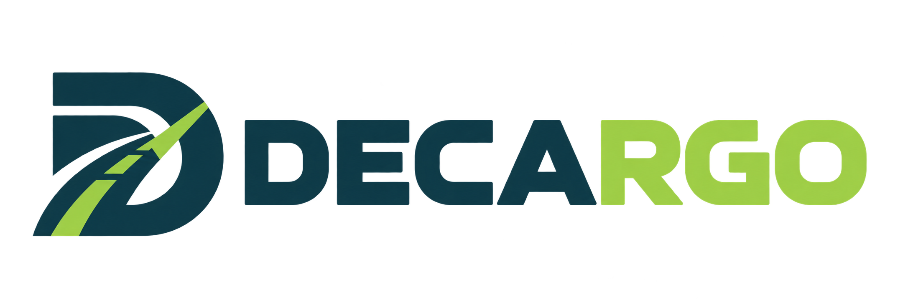

# DECARGO

**Software gratuito y autoalojado para emitir y gestionar el Documento de Control Administrativo electrónico (DeCA)** del transporte público de mercancías por carretera en España.

La oficina prepara el transporte y DECARGO genera el DeCA en PDF con su código QR y su enlace https. El conductor lo lleva en el teléfono, también sin cobertura, y lo enseña cuando se lo piden. Cada empresa lo instala **en su propio servidor**: no es un servicio en la nube de terceros y los datos no salen de la empresa.

- Web del proyecto y demostración con datos ficticios: <https://decargo.duckdns.org/> → «Probar DECARGO».
- Estado: **en desarrollo activo**. Por defecto, todos los PDF llevan el rótulo «DOCUMENTO DE PRUEBA» hasta que el administrador desactiva el modo de pruebas.

## Qué hace
- **DeCA en PDF con QR** (apartados a-h del art. 6 de la Orden FOM/2861/2012): modelo propio o carta de porte con casillas numeradas. Si el transporte cambia (vehículo, conductor), se crean versiones con el mismo enlace y las anteriores se conservan.
- **Transportes** con varios lugares de carga y descarga, palets, referencias y precintos. Estados: pendiente (sin conductor), en curso, finalizado y anulado. Relevo entre conductores.
- **Aplicación del conductor** (web instalable y app Android): su transporte, el DeCA y el QR (también sin cobertura), «cómo llegar», el PIN de la tarjeta de combustible y finalizar su parte o el transporte completo.
- **Avisos** al asignar o modificar un transporte. En la app Android encienden la pantalla.
- **Agenda** de empresas y lugares, **conductores y su ficha** (datos sensibles cifrados), **vehículos** y **caducidades** (ITV, tacógrafo, CAP, seguros…).
- **Seguridad**: verificación en dos pasos para la oficina, dispositivos autorizados por la oficina, auditoría encadenada y copias de seguridad cifradas.

## Instalación
Requisitos: un equipo con **Docker y Docker Compose**, 2 GB de RAM y 5 GB de disco, más una **dirección https** (dominio y certificado) para los QR.

**Linux**
```bash
git clone https://github.com/FarAoN0211/decargo.git
cd decargo
./instalar.sh
```

**Windows 10/11:** instala [Docker Desktop](https://www.docker.com/products/docker-desktop/) (motor WSL 2), descarga este repositorio y haz doble clic en **`INSTALAR-WINDOWS.bat`**.

Guía completa, con el proxy https, las copias de seguridad y las actualizaciones: **[docs/INSTALACION.md](docs/INSTALACION.md)**.

**App Android para conductores:** descárgala de [Releases](https://github.com/FarAoN0211/decargo/releases/latest) (cada versión indica su SHA-256) o desde la web pública de tu instalación.

## Documentación
| Documento | Contenido |
|---|---|
| [docs/INSTALACION.md](docs/INSTALACION.md) | Instalación en Linux y Windows, https, primer administrador, actualizaciones |
| [docs/OPERACION.md](docs/OPERACION.md) | Comandos `./deca`, usuarios, copias de seguridad y restauración |
| [docs/TRASLADO_SERVIDOR.md](docs/TRASLADO_SERVIDOR.md) | Cambiar de servidor o de dominio sin perder los QR |
| [REQUISITOS_LEGALES_DECA.md](REQUISITOS_LEGALES_DECA.md) | Investigación de la normativa del DeCA (no es asesoramiento jurídico) |
| [docs/03_arquitectura_y_diseno.md](docs/03_arquitectura_y_diseno.md) | Arquitectura y decisiones de diseño |
| [ESTADO_PROYECTO.md](ESTADO_PROYECTO.md) | Diario del desarrollo y estado de cada función |

Arquitectura en breve: PostgreSQL 16, API en Node.js (Fastify), servicio de documentos de solo lectura (`/d/`), web en Vue servida por nginx, y copias con restic. Todo en contenedores Docker.

## Aviso legal
DECARGO es una herramienta. **La empresa que emite el DeCA es responsable de su contenido** y de cumplir la normativa (Ley 9/2025, Orden FOM/2861/2012, Resolución de 5 de junio de 2026 de la DGTCF, RGPD). La documentación jurídica del proyecto es una investigación técnica, no asesoramiento legal. El software se entrega «tal cual», sin garantías.

## Licencia
**Gratuito, pero no se puede vender.** Apache License 2.0 con la condición «Commons Clause» v1.0, © 2026 FarAoN0211.

Puedes usarlo en tu empresa, modificarlo y compartirlo gratis. **No puedes venderlo**, ni el original ni versiones modificadas, **ni cobrar por servicios cuyo valor venga sobre todo de DECARGO** (alojarlo para otros, instalarlo o mantenerlo cobrando). Resumen en castellano: [LICENCIA.md](LICENCIA.md) · Texto que vale: [LICENSE](LICENSE). No es una licencia «de código abierto» según la definición de la OSI.
